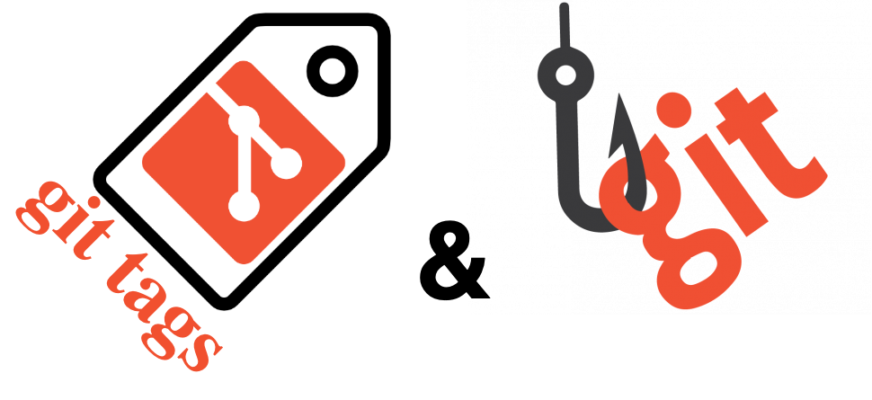
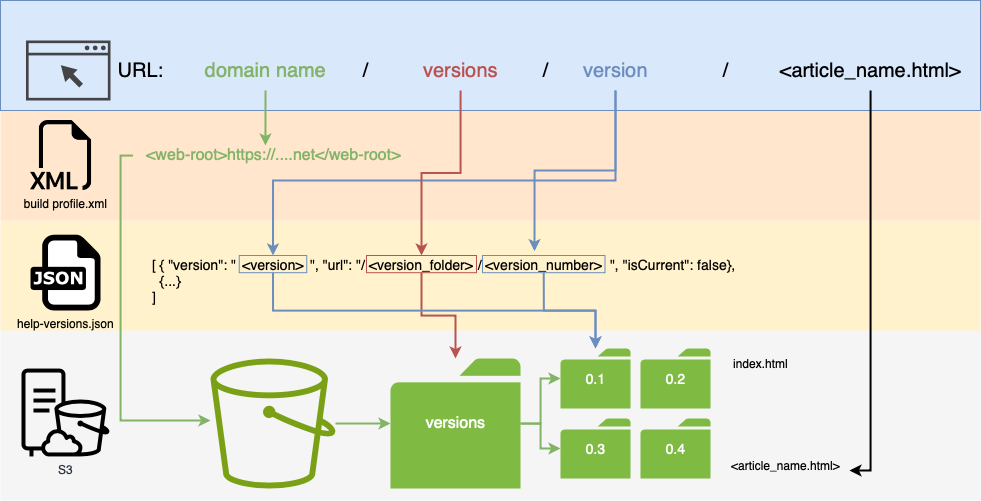
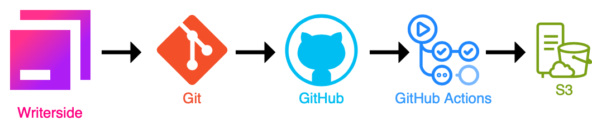
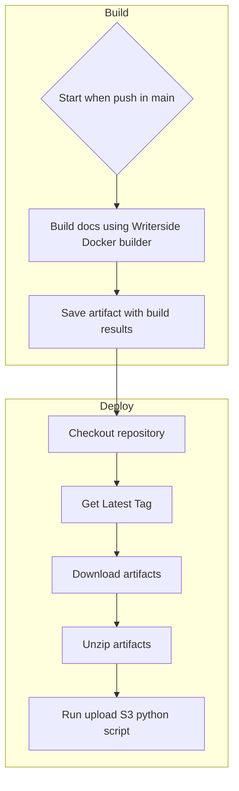

# Writerside: deploy multi-version documentation on S3-compatible storage


Many modern Docs-as-Code systems provide multi-versioning (MVS) and multi-instance mechanisms (MIS) for documentation. Writerside (WRS) provides MVS too, but WRS's MVS implementation gives users the opportunity to design how to use it themselves.

There are a few main ways to manage MVS in WRS:

1. Using a multi-branch way:
    | Advantages | Disadvantages |
    |------------|----------------|
    | One branch for each version. | Many legacy branches. |
    | Commits can be made to any version of the documentation. | Needs to track all versions of the documentation. |
    | Each build can be tested in its respective branch. | Each build must be deployed individually. |

    The main advantage of this approach is the flexibility to manage every version of the documentation and the opportunity to add content to any version.

2. Using git tags and githooks to sync local and remote tags:
    | Advantages | Disadvantages |
    |------------|----------------|
    | Documentation according with code by the git tags. | May appear a lot of versions. |
    | One documentation in the `main` branch. | Cannot commit to previous versions of the documentation. |
    | Preparing `pull requests` in individual branches. | - |

In this article, we show how to deploy MVS documentation on S3 by using git tags, githooks and GitHUB Actions. 

The main workflow of the production process is illustrated in the following image:


## Intro to git tags and githooks {#intro-to-git-tags-and-hooks}



Git tags mark specific points in a repository’s history as important. Typically, git tags are used to mark release points, for example: `v1.0`, `v2.0`, and so on. Learn more by following this [link](https://git-scm.com/book/en/v2/Git-Basics-Tagging).

Tags are not bound to branches and pull requests. Tags can be created in a local repository and pushed to a remote repository, or tags can be created on GitHub and pulled to a local repository. Here is a simple example to create tags in a local repo, push them to a remote repo, and get a list of tags:

| Command | Description | Extra info |
|---------|-------------|------------|
| `git tag` | Get a local tags list. | If the print is empty, that means tags are not created. |
| `git ls-remote --tags origin` | Get a remote tags list. | Replace `origin` with your remote name if different. |
| `git tag <tagname>` | Create a local tag. | Replace `<tagname>` with your desired tag name. |
| `git push origin <tagname>` | Push a local tag to the remote repository. | Replace `origin` with your remote name and `<tagname>` with your tag name. |

One important point in creating tags is naming. You can create tags with different naming patterns, but check the recommended naming practices and templates by following this [link](https://semver.org) first. For our purposes, we choose this template: `XX.XX` -- the first set of `XX` represents the major version, and the second set of `XX` represents the minor version. We don't use any prefixes or suffixes, because our deployment logic uses tags as floating numbers and employs mathematical operators to compare the current tag with other tags on the timeline.

Another cool git feature is [githooks](https://git-scm.com/docs/githooks). Githooks are scripts located in `$GIT_DIR/hooks` and are run by different git actions at various steps of the git process, such as pre-commit, post-commit, pre-rebase, post-checkout, etc.
To activate githooks, navigate to `$GIT_DIR/hooks` and choose the desired step of the git process. Rename the selected step by removing the `.sample` extension and clearing all data in the file. Then, add the bash script into the file.

For example, we add logic to run a Python script, which runs the git tags sync process:

```bash
#!/bin/bash

remote_main_branch="origin"
help_versions_json_path="./help-versions.json"
version_uri="/versions/"
ws_instance_cfg="./Writerside/writerside.cfg"

python3 /Users/pseudolukian/writerside-hooks/githooks/main.py $remote_main_branch $help_versions_json_path $version_uri $ws_instance_cfg
```

Now, when we run the command `git commit -m ...`, the pre-commit script runs.

## About MVS in WRS {#mvs-in-wrs}


The MVS in WRS consists of two main elements:
1. Configuration files in the WRS documentation project:
    * `<versions-switcher>` option in `.../<WritersideProjects_dir>/<Project_name>/Writerside/cfg/buildprofiles.xml`: 
    ```xml
    <buildprofiles ...>
    <variables>
        <web-root><full_url_path_to_doc_domain></web-root>
    </variables>
    <build-profile instance="<instance_name>">
            <variables>
                ...
                <versions-switcher><path_to_version_switcher_file_json></versions-switcher>
            </variables>
        </build-profile>
    </buildprofiles>
    ```
    `web-root` is the full URL path to the documentation hosting domain. This URL is used as the root for creating URLs of documentation versions in the version switcher file.  
    `versions-switcher` is the path to a special JSON file with a list of URLs of documentation versions.
    * `<instance ... />` option in `.../<WritersideProjects_dir>/<Project_name>/Writerside/writerside.cfg`:
    ```xml
    ...
    <instance src="writerside.tree" version="<current_version>"/>
    ...
    ```
    * List of versioning URLs in the version switcher JSON file, usually named `help-version.json`:
    ```json
    [
    { "version": "<version>", "url": "/<version_folder>/<version_number>", "isCurrent": false},
    { "version": "<current_version>", "url": "/", "isCurrent": true}
    ]
    ```
    The `url` option is formed by: `<web-root>` (from `buildprofiles.xml`) + `<uri_template>` (your personal URI template) + `<version_of_documentation>`. For example: `"url": "/versions/0.1"`.
    The latest version of the documentation uses the `/` URL in the S3 case because, by default, S3 retrieves `index.html` from the root of the bucket.

2. Building documentation on S3 (in our case) by folders like a `<S3_root>/`. The S3 bucket structure and URLs in the version switcher have a logical relationship, where `/<version_folder>/<version_number>` == `S3://<version_folder>/<version_number>`. 

The logical scheme of the working MVS in Writerside can be seen like this:


## Build and deploy documentation by using GitHub Actions {#deploy-doc-github-actions}



GitHub Actions is a workflow consisting of jobs that run on GitHub's VM. The jobs consist of steps. Jobs, steps, and their properties are described in special GitHub workflow files located in `<your_local_repository>/.github/workflows`. For example, here is a part of the workflow to build and deploy documentation on S3:
```yaml
name: Build production documentation # Name of the workflow, which will be shown in GitHub UI
#=================== Trigger setup options ====================#
on:                  # When the workflow is triggered
    push:            # Triggered when a branch is pushed or merged into the specified branches
        branches:    # List of branches where the trigger is activated
            - main
    workflow_dispatch:                      # Manual run option
env:                                        # Environment variables list
    INSTANCE: 'Writerside/writerside'       # Name of the documentation instance
    DOCKER_VERSION: '243.21565'             # Version of the Docker image
jobs:                                       # Jobs area
    
    build:                                  # Environment options for running the steps
      runs-on: ubuntu-latest              # OS where steps are run
      steps:                              # Steps area
        - .... some previous setup environment steps ... 
        - name: Build docs using Writerside Docker builder # Step name
          uses: JetBrains/writerside-github-action@v4      # Specifies the GitHub Action to be used from a repo
          with:                                            # Passes input parameters to that Action
            instance: ${{ env.INSTANCE }}                  # Writerside instance name
            artifact: ${{ env.ARTIFACT }}                  # Artifact name for the documentation build
            docker-version: ${{ env.DOCKER_VERSION }}      # Docker image version
    
    deploy: # The 'deploy' job ensures the final application is uploaded after a successful build.
      needs: build # It depends on the 'build' job so that deployment only starts if the build completes.
      runs-on: ubuntu-latest # It runs on the 'ubuntu-latest' virtual environment for consistent dependencies.
      steps: # The 'steps' section defines each task in the deployment phase.
        - .... some previous setup environment steps ... 
        - name: Run upload script # For example, one step is used specifically to execute the upload script.
          run: | 
            python ./.github/workflows/scripts/run_upload_doc_to_s3.py "${{ vars.S3_ENDPOINT }}" "${{ vars.S3_REGION_NAME }}" "${{ vars.S3_BUCKET_NAME }}" "${{ secrets.S3_ACCESS_KEY_ID }}" "${{ secrets.S3_SECRET_ACCESS_KEY }}" "/home/runner/work/writerside_docs/writerside_docs/artifacts" "versions" "${{ env.TAG }}" "['versions']"       
```

The full workflow can be downloaded from this [repo](https://github.com/Pseudolukian/writerside-automator). This workflow is shown in the following scheme:


The main logic of production documentation on S3 is realized by the Python script `run_upload_doc_to_s3.py`. Under the hood, the script calls `boto3`, which establishes a session and then step-by-step runs the following functions:

1. `S3_dir_worker` -- checks the S3 bucket folder structure. If the function finds the `versions` folder in the S3 bucket, it calls `upload_doc_to_s3_root`. Both functions prepare the S3 session and upload the documentation to S3.
2. `upload_doc_s3` -- uploads the documentation to the `versions/<current_tag>` folder.
3. `upload_doc_to_s3_root` -- uploads the documentation to the root of the S3 bucket, where it takes `index.html` as the latest version.

You can find the `run_upload_doc_to_s3.py` script at this [link](https://github.com/Pseudolukian/writerside-automator/blob/main/workflows/scripts/upload_doc_to_s3.py) or contribute to the [project](https://github.com/Pseudolukian/writerside-automator).

## Result {#result}

As a result, we have MVS documentation hosted on S3 storage with an easy way to manage content through GitHub. Using git tags, in our opinion, is preferable compared to the multi-branch approach because you only have the `main` branch as the actual version of the documentation, and you do not need to manage multiple versions in different branches.

In the next articles, we will show how to use the multi-branch approach to build and deploy MVS documentation on S3.
