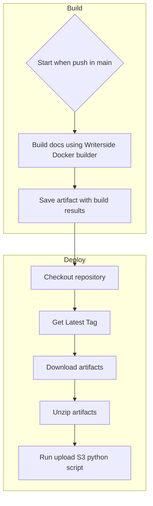

# About Writerside gitHub's workflows

The workflows in this repository help you create a CI/CD production and preview-ready pipeline more quickly. For preview builds, the build_test_doc.yaml is used. This workflow is based on GitHub Pages for previewing the latest build of the documentation. For production documentation, build_prod_docs.yaml is used. This workflow uses `boto3` to upload documentation to S3-compatible storage (AWS, Azure, Yandex Cloud, etc.).

## How the production deploy workflow works

The production deploy workflow is based on [JetBrains' Writerside GitHub Action](https://github.com/JetBrains/writerside-github-action) and uses Python 3 scripts (boto3) to upload documentation to S3.

To run workflows, you need to add the following secrets and variables to the repository:

1. Secrets:
  * `S3_ACCESS_KEY_ID` - This is the ID of the access key. You can obtain this key using the AWS CLI or the AWS Management Console.
  * `S3_SECRET_ACCESS_KEY` - This is the secret part of the access key. You can obtain this key using the AWS CLI or the AWS Management Console.

2. Variables:
  * `S3_BUCKET_NAME` - The name of the S3 bucket where the documentation will be uploaded.
  * `S3_ENDPOINT` - The S3 hosting endpoint to connect to. You can find the default AWS S3 endpoints at AWS S3 Endpoints.
  * `S3_REGION_NAME` - The region where your S3 storage is located. The default AWS S3 regions can be found at [AWS Regions](https://docs.aws.amazon.com/general/latest/gr/s3.html).

Workflow deploy documentation on S3:

    
In the build phase, the workflow creates an artifact and names it docs. In the production phase, the workflow downloads the artifact, unzips it, and runs run_upload_doc_to_s3.py.

You can find information about the logic of the Python scripts in the scripts folder.